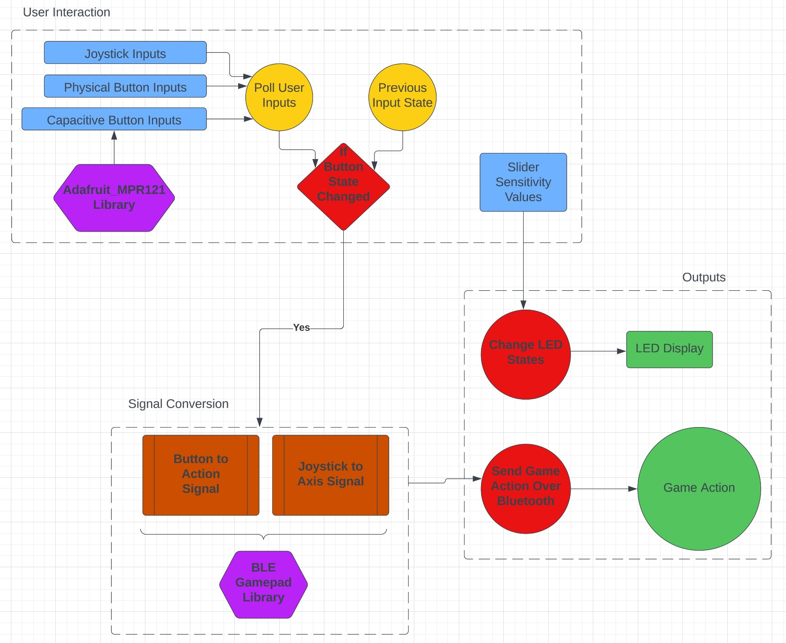

# Software Report

## Libraries

E-Remote is programmed using the Arduino IDE for its compatibility with the Adafruit HUZZAH32 ESP32 Feather board and access to the two driving libraries, Adafruit_MPR121 and ESP32-BLE-Gamepad. These two libraries are essential to the E-Remote program and implement the numerous functionalities needed for E-Remote to act as a game controller.

### Adafruit_MPR121
The Adafruit_MPR121 library is used to communicate with the MPR121 Capacitive touch board. The Adafruit_MPR121 object needs to be constructed and run its begin function, but its main use is the MPR121.touched() function which returns an uint16_t value representing the state of all twelve touch buttons. This value is then bit shifted by an amount representing the pin whose state the program wants to check and stored in a boolean value.

### ESP32-BLE-Gamepad
ESP32-BLE-Gamepad is the heart of the program as it takes the E-Remote and turns it into a video game controller. The first thing it does is enable the  ESP32-WROOM-32E chip and allow the ESP to connect to the computer via Bluetooth. Second, it registers as a Bluetooth game controller so it can be properly recognized by the computer. Finally, it takes user inputs and properly converts them to the game action signal (A button to A action, left joystick to move, etc.). 

## Wireless Controller

### Explanation
Since the ESP is programmed with the Arduino IDE, the code is written in the C++ programming language. 
The program follows the basic Arduino programming structure of the Setup and Loop blocks. 
The Setup loop is used for initialization. It declares input pins for the physical buttons, starts the MPR121 chip, and most importantly, sets the configurations for the ESP32-BLE-Gamepad so there are no extraneous controls added.
The Loop will cycle through every user input and check its current state, and send its corresponding signal to the computer. 

If the input is a button (physical or touch), the program will check its current state against its previous state and will only send an updated signal if the state has changed, preventing extraneous repeat signals from being sent. 
It is important to note that although the state storage arrays and library variables are global variables, this is normal for Arduino-style code since there is no singular Main function to both declare and use variables and the loop and set-up blocks cannot access each other's variables. 

The joysticks are not as simple as they output noise when at rest which can cause the player controlled character to move even when their hands are at rest. 
To circumvent this, the device will take 3000 reads from each joystick axis and finds all their maximum and minimum values. Then, while in the loop, the code will take 100 reads of each axis and average them to find a value. 
If this value falls inside of the max and min for that axis, the code will instead send a rest value of 16383 which is true neutral for any joystick axis. 
Otherwise, it will map the value from the joysticks 0-4095 to the computer's range of 0-32767 to find the movement position.

### Pseudocode

```
Setup {
    MPR121 Begin
    Physical Button Pins = Input
    Set Gamepad Configurations

    for each Joystick Axis{
        Take 3000 reads
        Set Axis Max
        Set Axis Min
    }
}

Loop {
    Poll Inputs

    If Button{
        Check previous state and send Button Signal if changed
    }
	
    If Joystick{
        Average 100 reads
        If Average in Rest Range: send Rest Val
        Else: Map 0-4095 -> 0-32767
    }
    Send Joystick Signal
}
```

### Block Diagram

